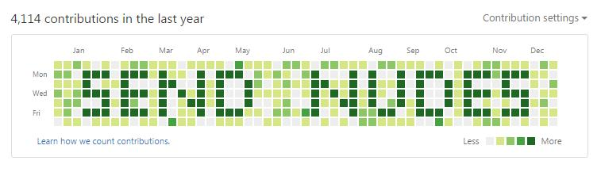
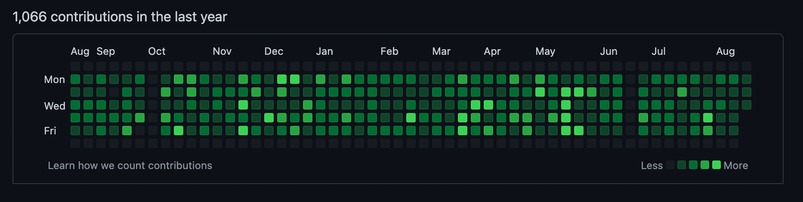

#  Github Chad!

---

> 🚨 WARNING: This repository may contain flashing takes, joke patterns, and memes that can trigger seizures or cause discomfort in humor-intolerant individuals with _**pseudo-professionalism syndrome**_.
> 
> If you or anyone in your family has a history of pseudo-professionalism syndrome, please consult a psychologist before checking the repository out.
> 
> If you experience any symptoms such as dizziness, altered vision, eye or muscle twitches, loss of awareness, disorientation, or convulsions while seeing the memes, immediately stop looking at them and seek professional laughter.
> 
> Check the repository out in a well-lit room and take regular breaks.

# Introduction

We once thought the "**Perfect Github contribution graph**" was just a meme or a form of self-expression.

## We were completely wrong!

While some unique self-assertion issues exist:

There are some other, absolutely sane people took this meme seriously! 

And they are:

As developers, it's hard to see what the graph reveals about a candidate, who might:
- Use GitHub corporate for work
- Have multiple accounts
- Enjoy life outside of coding
- Many other reasons...

However, it's a dead serious information, which may be somewhat theoretically understandable for an intern/junior position, but some HRs do this even for middle role positions.

---

# Description

So, I built a script to simplify this process for you and improve the "talent recruitment process" for HRs.

## How it works:
1. Create a new private repository on GitHub.
2. Copy the repository link.
3. Run the file `app.py`.
4. You will be asked:
    - `How many commits you want to perform?`
        - Enter a numeric value (e.g., `7`).
    - `Do you want to autocommit every day? Y/N`
        - Press `Y` to schedule daily commits automatically.
        - Press `N` to perform it only once.
5. Done! Your GitHub graph will soon look like this:

---
# License

This repository is provided as-is and is intended for personal use only. 
You are allowed to use and modify the code within this repository for your own purposes. 
Redistribution, commercial use, or use in any other project or context is strictly prohibited without explicit permission from the author.

### Permissions
- Personal use
- Modification for personal use

### Restrictions
- No redistribution
- No commercial use

For any other uses, please contact the author for permission.

### Disclaimer
The author is not responsible for any damages, liabilities, or issues that arise from using this code. Use it at your own risk.

© 2024 Armen-Jean Andreasian

---

# P.S. 
I do hope and wish you to find a company that measures your competence by your knowledge, not by ridiculous things like this. Peace.
